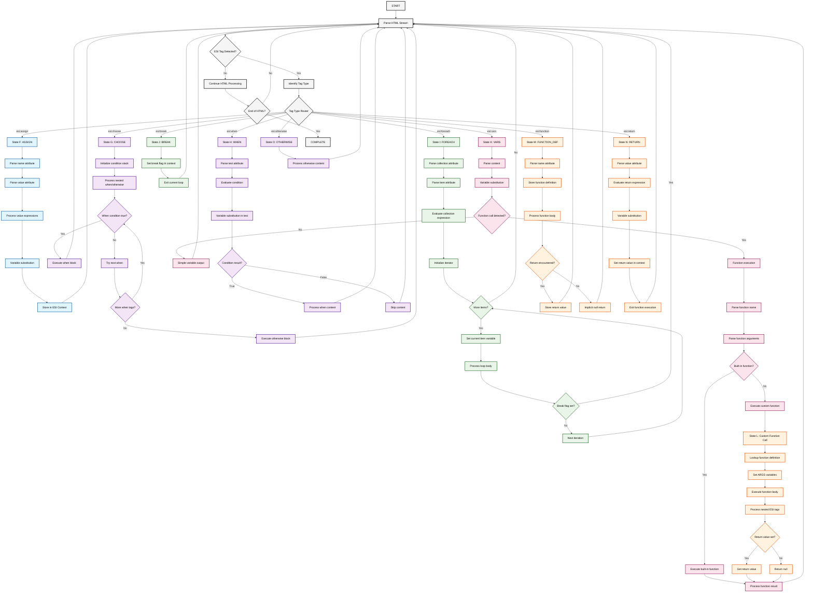

# ESI Resolver Worker

A Cloudflare Worker implementation for processing Edge Side Includes (ESI) tags in HTML responses. This worker provides server-side includes, conditional logic, loops, variable substitution, and custom functions.

## Finite State Machine Architecture

The ESI resolver follows a Finite State Machine (FSM) approach to process ESI tags systematically:

```
[Start] → [Parse HTML] → [ESI Tag?] → [Route to Handler] → [Process] → [Continue/Complete]
```

### State Flow:

1. **Parse HTML Stream**: Use HTMLRewriter to scan for ESI tags
2. **Tag Detection**: Identify ESI tag type and route to appropriate handler
3. **Tag Processing**: Execute tag-specific logic (include, assign, choose, etc.)
4. **State Management**: Handle variables, loops, conditions, and function calls
5. **Content Replacement**: Replace ESI tags with processed content or remove them
6. **Continue Processing**: Move to next content or complete

### Detailed FSM State Diagram

The following diagram shows the complete state machine with specific states for each ESI tag type based on real HTML template analysis:



### State Breakdown

#### **State F: ASSIGN** (`esi:assign`)
Handles variable assignment with complex expression evaluation:
- **F1**: Parse name attribute 
- **F2**: Parse value attribute (handles complex expressions)
- **F3**: Process value expressions (string concatenation, function calls)
- **F4**: Variable substitution (`$(variable)`, `$(GEO{'country_code'})`)
- **F5**: Store in ESI Context variables map

**Real patterns from HTML templates:**
- Simple assignment: `<esi:assign name="isCrawler" value="false"/>`
- Complex expressions: `<esi:assign name="redirectEsi" value="'/' + $(setCountry) + '/' + $(setLanguage) + '.html'"/>`
- Function results: `<esi:assign name="acceptLanguage" value="$string_split($(item), ';')"/>`

#### **State G: CHOOSE** (`esi:choose`)
Manages conditional logic with nested when/otherwise blocks:
- **G1**: Initialize condition evaluation stack
- **G2-G7**: Process nested conditions with proper fallback logic
- Handles up to 4 levels of nesting found in real templates

**Real patterns:**
- Country/language validation with multiple nested conditions
- Crawler detection with boolean logic chains
- Cookie existence checks with complex branching

#### **State H: WHEN** (`esi:when`)
Evaluates individual conditional expressions:
- **H1-H4**: Parse and evaluate test conditions
- Supports complex expressions: `$(HTTP_USER_AGENT) matches $(crawler)`
- Boolean operations: `$(isSupported)`, `$exists($(variable))`

#### **State I: FOREACH** (`esi:foreach`)
Handles iteration over collections with break support:
- **I1-I4**: Parse collection and item attributes
- **I5-I9**: Main iteration loop with break flag detection
- **I8**: Critical break flag check (from nested `<esi:break/>` calls)

**Real patterns:**
- Crawler detection: `<esi:foreach collection="$string_split($(crawlerList),',')">`
- Language parsing: `<esi:foreach collection="$string_split($str($(HTTP_ACCEPT_LANGUAGE)), ',')">`

#### **State J: BREAK** (`esi:break`)
Provides early loop termination:
- **J1**: Set break flag in ESI context
- **J2**: Exit current foreach loop immediately

#### **State K: VARS** (`esi:vars`)
Executes variable substitution and function calls:
- **K1-K4**: Handle simple variable output
- **K5-K11**: Process function calls (both built-in and custom)

**Function execution patterns:**
- `$set_redirect()` calls for page redirects
- `$add_header()` calls for cookie/header management
- `$add_cachebusting_header()` for cache control

#### **State L: Custom Function Call**
Handles user-defined function execution:
- **L1-L7**: Function lookup, argument binding, and execution
- Supports recursive ESI processing within function bodies

#### **State M: FUNCTION_DEF** (`esi:function`)
Defines reusable custom functions:
- **M1-M6**: Parse function name and store definition
- Contains custom functions from templates:
  - `checkCountryLanguageExists`
  - `getPreferredLanguage` 
  - `countryLanguageIsSupported`
  - Cookie parsing functions

#### **State N: RETURN** (`esi:return`)
Handles function return values:
- **N1-N5**: Parse and evaluate return expressions
- Supports complex return values with variable substitution

#### **State O: OTHERWISE** (`esi:otherwise`)
Provides fallback logic for choose blocks:
- **O1**: Process default/fallback content when no when conditions match

## Supported ESI Tags

### Core Tags

#### `esi:include`
Include external HTML fragments.
```html
<esi:include src="/fragments/header.html" onerror="continue"/>
<esi:include src="/api/user/$(REQUEST_PATH)" />
```

**Features:**
- Variable substitution: `$(REQUEST_PATH)`, `$(QUERY_STRING{'param'})`, `$(RU)`, `$(LC)`
- Error handling with `onerror="continue"`
- Fragment host configuration
- Loop protection with headers

#### `esi:assign`
Assign values to variables.
```html
<esi:assign name="userType" value="guest"/>
<esi:assign name="redirectUrl" value="'/home/' + $(country) + '/' + $(language)"/>
```

#### `esi:vars`
Variable substitution and function execution.
```html
<esi:vars>$set_redirect($(redirectUrl))</esi:vars>
<esi:vars>$add_header('Set-Cookie', $(cookieValue))</esi:vars>
```

### Conditional Logic

#### `esi:choose`, `esi:when`, `esi:otherwise`
Conditional branching logic.
```html
<esi:choose>
  <esi:when test="$(isCrawler) == true">
    <esi:assign name="redirectUrl" value="'/crawler-page.html'"/>
  </esi:when>
  <esi:when test="$exists($(userPreference))">
    <esi:assign name="redirectUrl" value="$(userPreference)"/>
  </esi:when>
  <esi:otherwise>
    <esi:assign name="redirectUrl" value="'/default.html'"/>
  </esi:otherwise>
</esi:choose>
```

**Condition Types:**
- Existence checks: `$exists($(variable))`
- Equality: `$(var) == 'value'`
- Boolean evaluation: `$(flag) == true`

### Loops

#### `esi:foreach`
Iterate over collections with break support.
```html
<esi:foreach collection="$string_split($(crawlerList),',')" item="crawler">
  <esi:choose>
    <esi:when test="$(HTTP_USER_AGENT) matches $(crawler)">
      <esi:assign name="isCrawler" value="true"/>
      <esi:break/>
    </esi:when>
  </esi:choose>
</esi:foreach>
```

#### `esi:break`
Break out of loops.
```html
<esi:break/>
```

### Functions

#### `esi:function`
Define custom functions.
```html
<esi:function name="checkCountryLanguageExists">
  <esi:foreach item="language" collection="$(ARGS{0})">
    <esi:assign name="isSupported" value="($(language) == $(ARGS{1}))"/>
    <esi:choose>
      <esi:when test="$(isSupported)">
        <esi:break/>
      </esi:when>
    </esi:choose>
  </esi:foreach>
  <esi:return value="$(isSupported)"/>
</esi:function>
```

#### `esi:return`
Return values from functions.
```html
<esi:return value="$(computedValue)"/>
```

### Removed Tags
These tags are removed during processing (handled as delete):
- `esi:comment` - Comments
- `esi:try`, `esi:attempt`, `esi:except` - Error handling (not implemented)
- `esi:eval` - Expression evaluation (security concern)

## Built-in Variables

### Request Variables
- `$(REQUEST_PATH)` - Current request path
- `$(QUERY_STRING{'param'})` - Query parameter value
- `$(HTTP_HOST)` - Request host
- `$(HTTP_USER_AGENT)` - User agent string
- `$(HTTP_COOKIE{'name'})` - Cookie value
- `$(HTTP_ACCEPT_LANGUAGE)` - Accept-Language header

### Geolocation Variables
- `$(GEO{'country_code'})` - Country code from geo data
- `$(RU)` - Region/country from URL path (position 1)
- `$(LC)` - Language code from URL path (position 2)

### Custom Variables
Variables defined using `esi:assign` are available for substitution.

## Built-in Functions

### String Functions
- `$string_split(string, delimiter)` - Split string into array
- `$lower(string)` - Convert to lowercase
- `$str(value)` - Convert to string

### Utility Functions
- `$exists(variable)` - Check if variable exists
- `$html_encode(value)` - HTML encode value
- `$set_redirect(url)` - Set redirect response
- `$set_response_code(code)` - Set response status code
- `$add_header(name, value)` - Add response header
- `$add_cachebusting_header()` - Add cache busting headers

## Implementation Architecture

### Class Structure

#### `EdgeSideIncludesBehavior`
Main ESI processor class that orchestrates the ESI resolution pipeline.

#### `ESIContext`
Manages execution state including:
- Variables storage (`Map<string, any>`)
- Function definitions (`Map<string, ESIFunction>`)
- Break flags for loop control
- Return values for functions

#### ESI Handlers
Specialized handlers for each ESI tag type:
- `EsiIncludeHandler` - Processes includes and fragment fetching
- `EsiAssignHandler` - Variable assignment
- `EsiChooseHandler` - Conditional blocks
- `EsiWhenHandler` - Condition evaluation
- `EsiOtherwiseHandler` - Default fallback
- `EsiForeachHandler` - Loop processing
- `EsiVarsHandler` - Variable substitution
- `EsiFunctionHandler` - Function definition
- `EsiReturnHandler` - Return values
- `EsiBreakHandler` - Loop breaks

### Processing Pipeline

1. **Initial Check**: Scan response for ESI tags
2. **First Pass**: HTMLRewriter processes tags and collects include promises
3. **Include Resolution**: Fetch external fragments concurrently  
4. **Second Pass**: Replace include tags with fetched content
5. **Variable Processing**: Process vars, assigns, and conditional logic
6. **Final Output**: Return processed HTML response

### Variable Substitution

Variables are processed using regex patterns:
- `$(VARIABLE_NAME)` - Direct variable substitution
- `$(QUERY_STRING{'param'})` - Query parameter extraction
- `$(HTTP_COOKIE{'name'})` - Cookie value extraction
- `$(GEO{'field'})` - Geolocation data access

### Error Handling

- **Include Errors**: Handled via `onerror="continue"` attribute
- **Loop Protection**: Headers prevent infinite ESI loops
- **Graceful Degradation**: Worker returns original response on processing errors
- **Fragment Failures**: Failed includes return empty content or error placeholder

## Usage Examples

### Basic Include
```html
<esi:include src="/fragments/navigation.html"/>
```

### Conditional Redirect
```html
<esi:choose>
  <esi:when test="$exists($(countryMap{$(GEO{'country_code'})}))">
    <esi:vars>$set_redirect('https://'+$(HTTP_HOST)+$(countryMap{$(GEO{'country_code'})}))</esi:vars>
  </esi:when>
  <esi:otherwise>
    <esi:vars>$set_response_code(404)</esi:vars>
  </esi:otherwise>
</esi:choose>
```

### Loop with Break
```html
<esi:foreach collection="$string_split($(crawlerList),',')" item="crawler">
  <esi:when test="$(HTTP_USER_AGENT) matches $(crawler)">
    <esi:assign name="isCrawler" value="true"/>
    <esi:break/>
  </esi:when>
</esi:foreach>
```

### Cookie Management
```html
<esi:assign name="cookie" value="'session_id=' + $(sessionId) + '; path=/; secure;'"/>
<esi:vars>$add_header('Set-Cookie', $(cookie))</esi:vars>
```

## Configuration

The worker can be configured via:
- `enabled` - Enable/disable ESI processing
- `enableViaHttp` - Allow enabling via HTTP headers
- Edge-control headers: `dca=esi` (enable) or `dca=noop` (disable)

## Security Considerations

- Input sanitization for variable substitution
- Loop protection to prevent infinite recursion
- Fragment host validation
- Header injection prevention
- Eval functionality disabled for security

## Performance

- Concurrent fragment fetching
- Streaming HTML processing
- Minimal memory footprint
- Edge-optimized execution
- Caching integration

## Deployment

Deploy as a Cloudflare Worker:
```bash
npm run deploy
```

The worker automatically processes responses containing ESI tags and passes through other content unchanged.